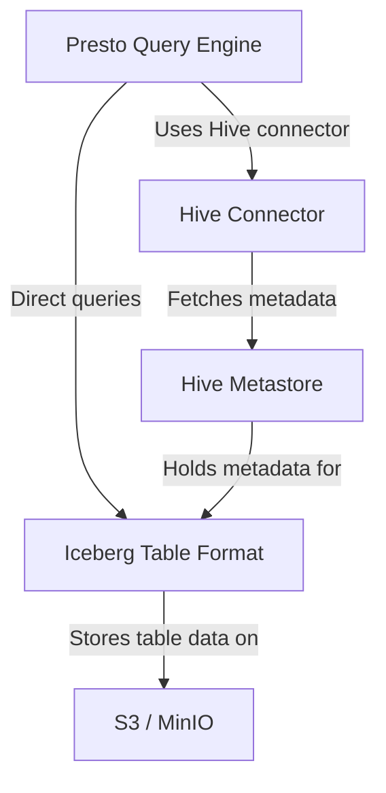

```mermaid
flowchart TD
    A[Presto Query Engine]
    B[Hive Connector]
    C[Hive Metastore]
    D[Iceberg Table Format]
    E[S3 / MinIO]

    A -->|Uses Hive connector| B
    B -->|Fetches metadata| C
    A -->|Direct queries| D
    C -->|Holds metadata for| D
    D -->|Stores table data on| E
```
