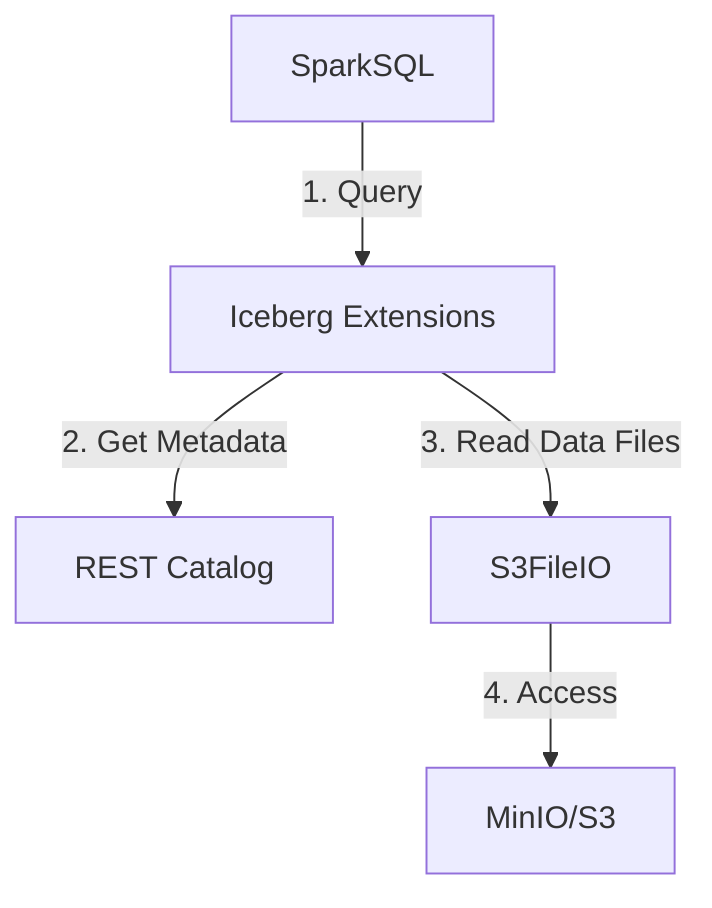

```mermaid
graph TD
    A[SparkSQL] -->|1. Query| B[Iceberg Extensions]
    B -->|2. Get Metadata| C[REST Catalog]
    B -->|3. Read Data Files| D[S3FileIO]
    D -->|4. Access| E[MinIO/S3]
```
# iceberg
