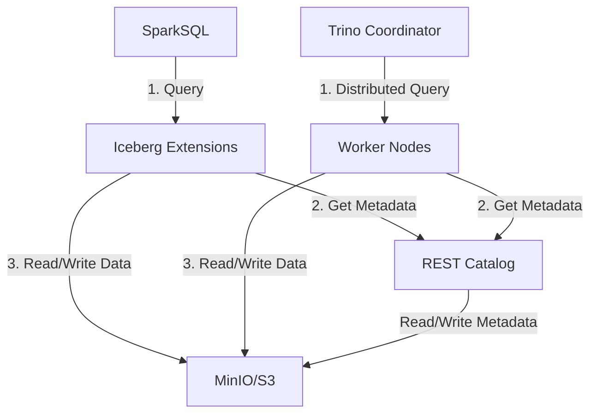

# Iceberg Rest Catalog Flow


# Iceberg
This repository demonstrates a simple example of using Apache Iceberg with both SparkSQL and Trino (formerly PrestoSQL) query engines. The architecture diagram above shows the key differences in how these engines interact with Iceberg tables:

## SparkSQL Flow
1. SparkSQL sends queries through Iceberg extensions which handle table management
2. Metadata is retrieved from the REST Catalog service
3. The actual data files are accessed through S3FileIO
4. Data is stored in MinIO (S3-compatible storage)

## Trino Flow
1. The Trino coordinator receives SQL queries and distributes work across worker nodes
2. Worker nodes perform parallel operations using Iceberg extensions
3. Data access is distributed across workers using S3FileIO for maximum throughput

Key Differences:
- **Architecture**: Spark uses a more monolithic approach where each executor handles both compute and I/O. Trino separates coordination from execution with dedicated workers.
- **Scalability**: Trino's distributed architecture is designed for larger clusters and concurrent queries, while Spark excels at batch processing.
- **Query Optimization**: Both have different query optimizers - Spark uses Catalyst while Trino has its own cost-based optimizer.

## Getting Started

1. Start the services:
   ```bash
   docker compose up -d
   ```
2. Wait for all services to be healthy:
   - REST Catalog (port 8181)
   - MinIO (port 9000)
   - Trino (port 8081)
   - Spark (port 8080) # If you want to use spark in a container 

3. Run the example:
   ```bash
   docker compose exec spark-iceberg python /home/iceberg/main.py
   ```

4. Verify the results:
   - Check MinIO console at http://localhost:9001
   - View Trino UI at http://localhost:8081
   - Examine Spark UI at http://localhost:8080

5. Launch spark.

    if you want to use spark locally, you can launch it with the following command:
       ```bash
       spark-submit \        
        --packages org.apache.iceberg:iceberg-spark-runtime-3.5_2.12:1.7.1,org.apache.iceberg:iceberg-aws-bundle:1.7.1 \
        src/main.py
       ```

    otherwise, you can use the spark-iceberg container by uncommenting the spark-iceberg service in the docker-compose.yaml file.
    keep in mind that you need to change the endpoints in the `main.py`,  `docker-compose.yaml` and `presto-catalog/iceberg.properties` file to match the the ones on the docker bridge network.
